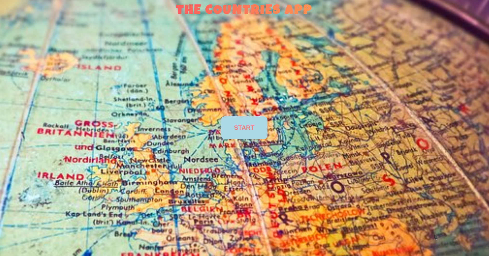
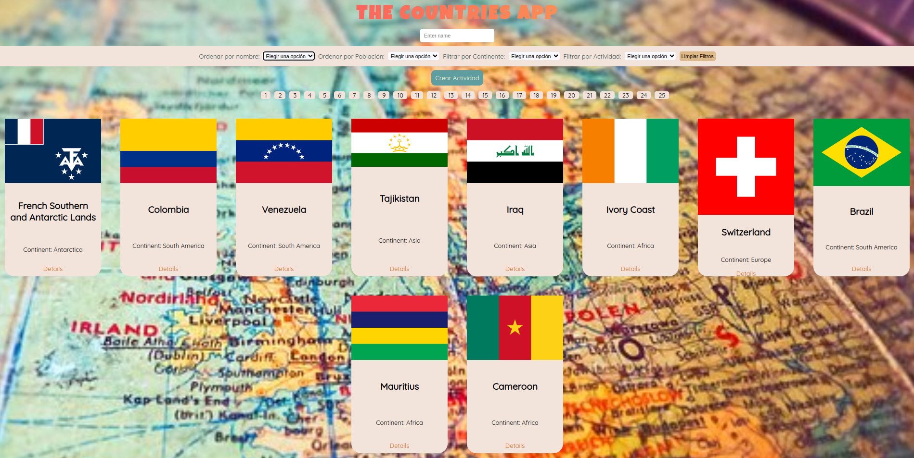
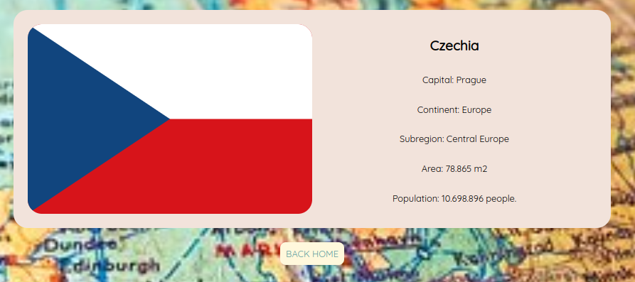
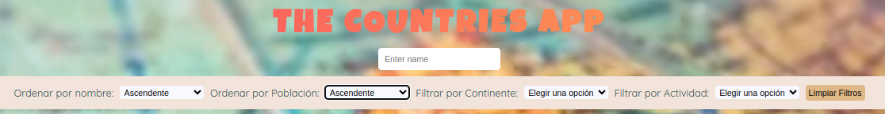
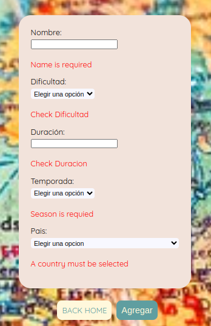

# **COUNTRIES** | Proyecto Individual Soy Henry de Ricardo Montecinos

- Single Page Application con tecnologías: **React**, **Redux**, **Node**, **Express** y **Sequelize**.

Esta es la portada:

Se renderizan las banderas de los paises:

Si elegís un país se puede acceder a su detalle:

Como también se puede ordenar, buscar y filtrar:

Y cargar actividades de cada país:

